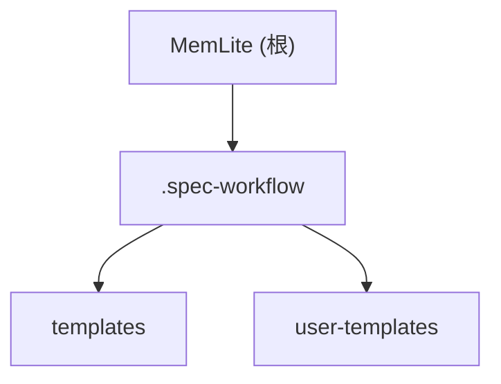

# MemLite - Agent 记忆系统

> 个人使用的 Agent 记忆系统

## 项目愿景

MemLite 是一个轻量级的 Agent 记忆系统，旨在为 AI Agent 提供持久化的记忆存储与检索能力，支持上下文管理和智能召回。

## 架构总览

```
memlite/
├── .spec-workflow/        # 规格工作流模板系统
│   ├── templates/         # 默认文档模板
│   └── user-templates/    # 用户自定义模板（可覆盖默认）
└── [待创建]              # 源代码目录
```

### 当前状态

项目处于**初始化阶段**，尚未开始核心开发。已配置规格工作流模板系统，用于指导后续开发过程。

## 模块结构图



## 模块索引

| 模块路径 | 职责 | 语言 | 状态 |
|---------|------|------|------|
| `.spec-workflow/` | 规格工作流模板系统，提供需求/设计/任务等文档模板 | Markdown | 已配置 |

## 运行与开发

> 待定 - 项目初始化阶段

### 环境准备
- 待确定技术栈后补充

### 常用命令
- 待定

## 测试策略

> 待定 - 项目初始化阶段

## 编码规范

> 待确定技术栈后补充

### 当前规范参考
- `.spec-workflow/templates/` 中的模板定义了代码组织原则：
  - 单一职责原则
  - 模块化设计
  - 清晰的接口定义

## AI 使用指引

### 开发建议
1. 项目处于早期阶段，建议先确定：
   - 核心技术栈（语言/框架）
   - 存储方案（文件/数据库）
   - API 设计风格

2. 可利用 `.spec-workflow` 模板系统：
   - 使用 `product-template.md` 定义产品方向
   - 使用 `tech-template.md` 确定技术选型
   - 使用 `requirements-template.md` 拆解功能需求

### 推荐开发顺序
1. 确定技术栈与架构
2. 实现核心记忆存储
3. 实现检索与召回
4. 添加 API 层（如需）

## 变更记录 (Changelog)

| 日期 | 变更内容 |
|------|---------|
| 2026-03-18 | 初始化 AI 上下文，创建 CLAUDE.md 和 .claude/index.json |
